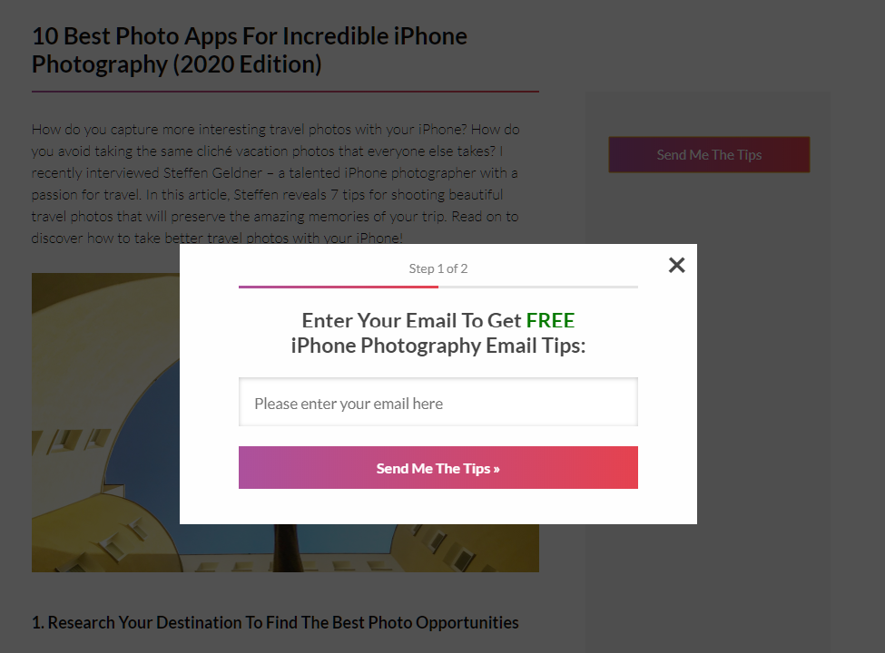

  

# iPhone Photography School Blog
**Tags:** IPS, Blog

**License:** GPLv3 or later

**License URI:** http://www.gnu.org/licenses/gpl-3.0.html

Simple blog article page with a popup form.

### Tech

* [Vue.js] - is an open-source Model–view–viewmodel JavaScript framework for building user interfaces and single-page application.
* [Laravel] - is a web application framework with expressive, elegant syntax.

### Requirements

* Vue 2.6 or higher.
* PHP 7.2 or higher.

## Screenshots

### License
----

GNU GPL v3

   [Vue.js]: <https://vuejs.org/>
   [Laravel]: <https://laravel.com/>